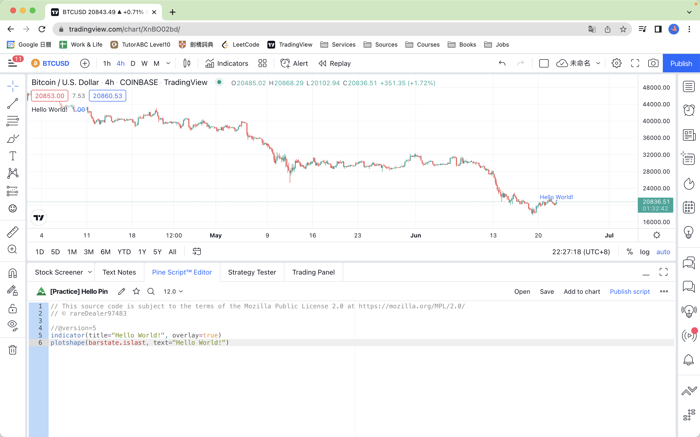
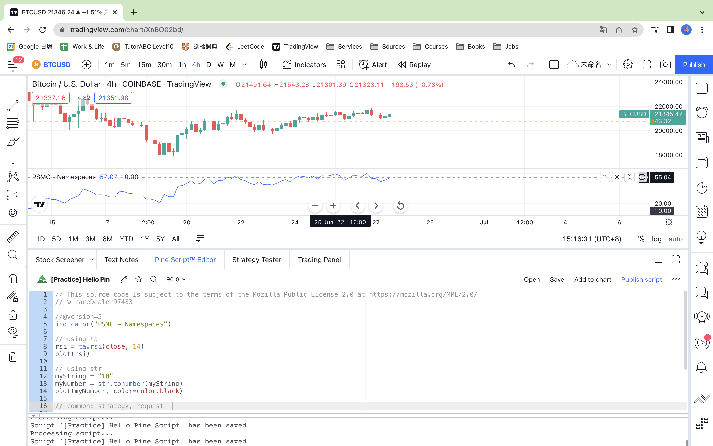

# Pine Script™ v5

## Pine Script Types

### indicator

### strategy

### library

## Compiler

### Button-Save

### Compile error

- without assigning a version number (@version) in a script
- inappropriate function in a particular type of script
- assigned NA to a variable without type keyword

## Syntax

### multiple lines for function parameters: using space to recognize, using tab is fine(must with a space).

## First Pine Script

### Hello World!

## [Indicator function](https://www.tradingview.com/pine-script-reference/v5/#fun_indicator)

### title, shorttitle, overlay, format

### precision, scale

### timeframe

### re-add to chart when the particular parameters changed, for example, overlay, scale

### related resources

- [format constants](https://www.tradingview.com/pine-script-reference/v5/#var_format{dot}volume)

- [scale constants](https://www.tradingview.com/pine-script-reference/v5/#var_format{dot}inherit)

## Namespaces & Libraries

### common namespaces

### using custom library

## Price & Indicator Series

### price, indicator series

## Data Types

### int, float, bool, color, string

## Variable Declaration

### na

### =, := 

### var

## Basic User Input

### priceInput, confirm=true

### timeInput, confirm=true

### inputs

## Generating Alerts

### [alert function ](https://www.tradingview.com/pine-script-reference/v5/#fun_alert)

- create alert for Any alert() function call

- higher close alert

- lower close alert

### [alertcondition function](https://www.tradingview.com/pine-script-reference/v5/#fun_alertcondition)

- function usage

- alertcondition selection

- create alert for HC/LC Alert

- alert happened

### [variable value in alert](https://www.tradingview.com/support/solutions/43000531021-how-to-use-a-variable-value-in-alert/)

## Plotting Data

### title, color, linewidth, style, trackprice

### histbase

### offset

### join

### editable

### show_last

### display

## Moving Average Crosses

### ema

## Hot Keys

### macOS

- search functions: option + space
- pop-up manual: command + click

## Resources

### [Pine Script BEGINNER'S GUIDE! 💹 [2022] ](https://www.youtube.com/watch?v=HYyuYgPRLpc)

- ⭐ Great Tutorial ⭐

### [Pine Script™ v5 User Manual](https://www.tradingview.com/pine-script-docs/en/v5/migration_guides/v4_to_v5_migration_guide.html)

- Official Guide

